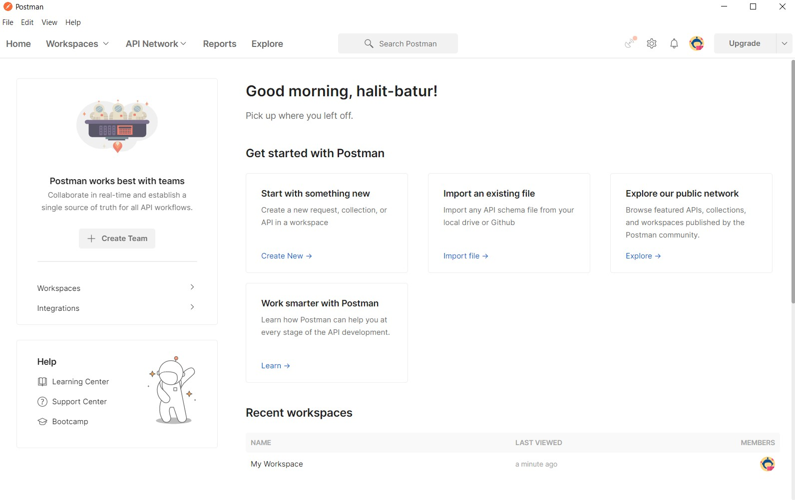

# Testing APIs with Postman
So what exactly is Postman and how helpful can it be for us to explore APIs? the learning objectives of this lesson are:
1. Understanding how to work with Postman
2. Exploring a public API
3. Understanding how helpful it can be while developing

What is Postman?
Postman is an API platform for building and using APIs. Postman simplifies each step of the API lifecycle and streamlines collaboration so you can create better APIs—faster.

It basically help us to test our own APIs while building them and test other public APIs before using them in order for us to see how the data format that we are receiving and deal with it accordingly in our application.

Now let's start with downloading [Postman](https://www.postman.com/downloads/).

After downloading and installing it succesfuly u should see something similar to this:

Now the API that we will be using it the [Twitter API](https://developer.twitter.com/en/docs/twitter-api), it's one of the most famous APIs that people can integrate into their applications to fetch certain tweets or even build a [twitter bot](https://us.norton.com/internetsecurity-emerging-threats-what-are-twitter-bots-and-how-to-spot-them.html)!

